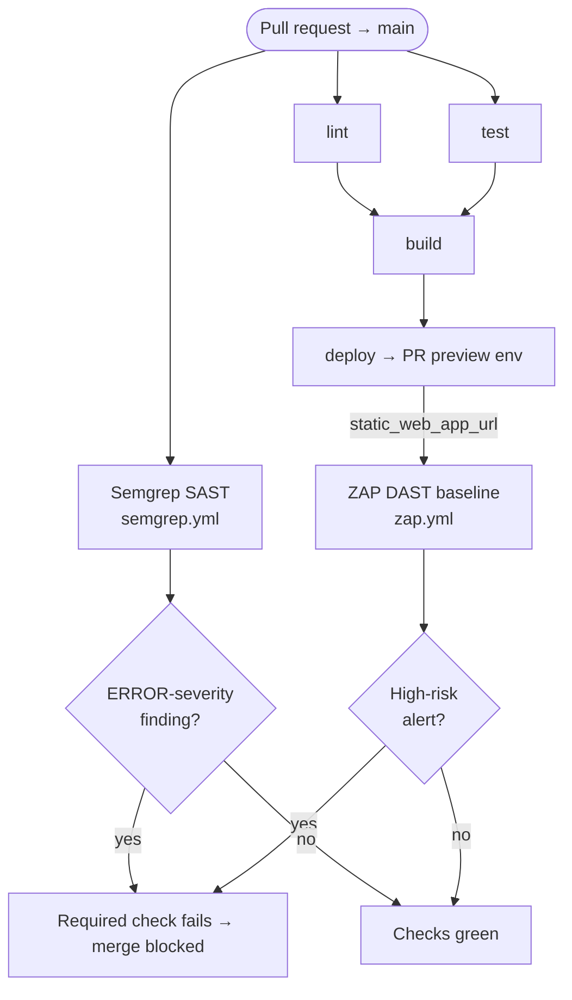

# Security Scanning: SAST (Semgrep) + DAST (OWASP ZAP)

How RetireGolden's automated application-security scanning works and how it plugs into the
GitHub Actions / Azure Static Web Apps pipeline described in [ci-cd-and-deploy.md](ci-cd-and-deploy.md).

Two complementary, fully open-source scanners run on every pull request to `main`:

- **Semgrep — SAST** (Static Application Security Testing): analyzes the **source code** without running it.
- **OWASP ZAP — DAST** (Dynamic Application Security Testing): scans the **running app** at its deployed PR preview URL.

Both **report every finding** but **gate (block) the merge only on high-severity issues**, so low/medium
noise never breaks the pipeline.

---

## At a glance

| | Semgrep (SAST) | OWASP ZAP (DAST) |
|---|---|---|
| Workflow | [`.github/workflows/semgrep.yml`](../../.github/workflows/semgrep.yml) | [`.github/workflows/zap.yml`](../../.github/workflows/zap.yml) (reusable) |
| What it inspects | Source code (static) | The deployed app (dynamic, black-box) |
| When it runs | `push` + `pull_request` to `main` | After the PR **preview deploy**, via the deploy workflow |
| Target | The repo checkout | The PR preview/staging URL (read from CI/CD, see below) |
| Ruleset / scan | `p/default` (OSS, local) | Passive **baseline** scan (non-intrusive) |
| Reports everything to | `semgrep-sarif` artifact + GitHub **code scanning** (Security tab) | `zap-baseline-report` artifact (HTML/MD/JSON) + job log |
| **Blocks the merge on** | **ERROR**-severity findings only | **High-risk** alerts only (`riskcode 3`) |
| Secrets required | None (pure OSS local scan) | None (built-in `GITHUB_TOKEN`) |
| Required status check | `Scan (p/default)` | `ZAP DAST / ZAP Baseline` |

---

## 1. SAST vs DAST — why both

They catch different classes of problems and are strongest together:

- **SAST (Semgrep)** reads the code and flags insecure patterns — injection sinks, dangerous APIs,
  hardcoded secrets, unsafe React patterns — early, before anything is deployed. It sees the code but
  not the running behavior.
- **DAST (ZAP)** drives the live, deployed app and observes real responses — missing security headers,
  cookie flags, information disclosure, XSS reflected at runtime. It sees behavior but not source.

Running both on each PR gives coverage from both directions.

---

## 2. Semgrep (SAST)

**Workflow:** [`.github/workflows/semgrep.yml`](../../.github/workflows/semgrep.yml)

- **Triggers** on `push` and `pull_request` to `main`.
- Runs inside the official `semgrep/semgrep` container.
- Uses the **`p/default`** ruleset — Semgrep's curated, low-false-positive set. This is a **purely local,
  open-source** scan: no Semgrep account or token is involved.

**Two-phase behavior (report, then gate):**

1. **Report** — `semgrep scan --config=p/default --sarif --output=semgrep.sarif` runs without `--error`,
   so it exits `0` regardless of findings. The SARIF is:
   - uploaded as the **`semgrep-sarif`** build artifact, and
   - published to **GitHub code scanning** (`github/codeql-action/upload-sarif`), so findings appear as
     PR annotations and in the **Security → Code scanning** tab. This upload is `continue-on-error`, so it
     never breaks the build (e.g. on a private repo without GitHub Advanced Security, it degrades to just
     the artifact).
2. **Gate** — a final step re-runs scoped to high severity:
   `semgrep scan --config=p/default --severity=ERROR --error`. `--error` makes the job (and therefore the
   required check) fail **only when an ERROR-severity finding exists**. WARNING/INFO findings remain
   visible in the report but do not block.

---

## 3. OWASP ZAP (DAST)

**Workflow:** [`.github/workflows/zap.yml`](../../.github/workflows/zap.yml) — a **reusable** workflow
(`workflow_call`), also runnable manually (`workflow_dispatch`).

- **How it's invoked:** the Azure deploy workflow calls it from a PR-only `dast` job *after* the preview
  deploy completes (see §4). It can also be run on demand from **Actions → OWASP ZAP DAST → Run workflow**
  against any URL.
- **Target — read from CI/CD, never hardcoded:** the `dast` job passes
  `target_url: ${{ needs.deploy.outputs.preview_url }}`, which is wired to the Azure deploy step's
  **`static_web_app_url`** output. Azure creates a fresh per-PR preview environment (e.g.
  `https://calm-forest-xxxxxxxxx-<PR#>.<region>.azurestaticapps.net`), and that URL changes per PR — so it
  must be read dynamically, which this does.
- **Scan type:** the **baseline** scan — passive only, non-intrusive, safe to run against a live
  environment, and fast.

**Two-phase behavior (report, then gate):**

1. **Report** — the action runs with `fail_action: false`, so the scan never fails on its own (otherwise it
   would block on Low/Informational noise like missing headers). It writes `report_json.json`,
   `report_md.md`, and `report_html.html` to the workspace and uploads them as the
   **`zap-baseline-report`** artifact. (`allow_issue_writing` is off — review via the artifact.)
2. **Gate** — a follow-up step parses `report_json.json` and fails the job **only when a High-risk alert is
   present** (`riskcode == "3"`). Low/Medium/Informational alerts are reported but never block. Because the
   artifact is uploaded before the gate runs, the full report stays available for review even when the gate
   fails.

---

## 4. How it fits the CI/CD pipeline

The base pipeline is the Azure Static Web Apps workflow
([`azure-static-web-apps-retiregolden.yml`](../../.github/workflows/azure-static-web-apps-retiregolden.yml)):
`lint` + `test` → `build` → `deploy`. The security scanners attach like this:

- **Semgrep** is an **independent workflow** that runs in parallel on every push/PR — it needs no
  deployment.
- **ZAP** is wired **into** the deploy workflow as the `dast` job, which `needs: [deploy]` and consumes the
  preview URL. It is **PR-only** (it does not run on push-to-`main`/production) and runs **after** deploy, so
  it can never affect or roll back the deployment.

`lint`, `test`, `build`, and `deploy` are jobs in the Azure workflow; Semgrep is its own workflow.

---

## 5. Gating & branch protection

A red check only blocks a merge if it is a **required status check**. The repo's **"Main Guard"** ruleset
(applies to the default branch) requires both:

- `Scan (p/default)` (Semgrep job)
- `ZAP DAST / ZAP Baseline` (the `dast` caller job / reusable ZAP job)

Configuration: `strict` policy is **off** (PRs don't need to be rebased before merging, to keep friction
low), enforcement is **active**, and the existing PR-review requirement and admin bypass are preserved.

Net effect: a PR is blocked when Semgrep finds an **ERROR** issue or ZAP finds a **High-risk** alert;
low/medium/informational findings are surfaced but never block.

> [!NOTE]
> **Label gate.** On PRs, **Semgrep always runs** (cheap scan, real required-check result on every push),
> but **ZAP** — like the rest of the deploy pipeline — runs only while the PR carries the **`run-ci`
> label**; see "Label-gated PR CI" in [ci-cd-and-deploy.md](ci-cd-and-deploy.md). Without the label the
> ZAP check reports **skipped** (via a no-op invocation of `zap.yml`), which *satisfies* the required
> check, so apply `run-ci` and let the scan finish before merging.

> [!WARNING]
> **Renaming coupling.** The required checks are keyed to **job/display names**. If you rename the Semgrep
> job (`Scan (p/default)`), the `dast` job (`ZAP DAST`), or the reusable ZAP job (`ZAP Baseline`), you must
> update the "Main Guard" ruleset's required-check contexts to match — otherwise every merge to `main` will
> block forever, waiting on a check that never reports under the old name.

---

## 6. Where to find results

| | Location |
|---|---|
| Semgrep findings | Actions run → **Artifacts → `semgrep-sarif`**; and **Security → Code scanning** (PR annotations) |
| ZAP findings | Actions run → **Artifacts → `zap-baseline-report`** (open `report_html.html`); the `dast` job log lists every rule `PASS`/`WARN`/`FAIL` and the High-risk gate result |

---

## 7. Configuration & secrets

**No new secrets are required.** Semgrep runs fully local (no token); ZAP uses the built-in
`GITHUB_TOKEN`; the Azure deploy continues to use the existing `AZURE_STATIC_WEB_APPS_API_TOKEN`.

- **Optional — Semgrep dashboard:** to send results to Semgrep Cloud (managed rules, triage UI), add a
  `SEMGREP_APP_TOKEN` repo secret and switch the scan command to `semgrep ci`. Not needed for the
  OSS-local setup.
- **Code scanning on private repos:** publishing SARIF to the Security tab requires GitHub Advanced
  Security on private repos. Without it, the upload step is skipped gracefully and the `semgrep-sarif`
  artifact remains the source of truth.

---

## 8. Running & extending

- **Run ZAP manually:** Actions → **OWASP ZAP DAST** → **Run workflow**, providing a `target_url` (handy for
  scanning production or an arbitrary environment).
- **Tune Semgrep coverage:** add rulesets to `--config` (e.g. `p/security-audit`, language packs), or change
  the gate threshold by editing the `--severity` value in the gate step.
- **Tune ZAP signal:** add a `.zap/rules.tsv` file to set specific rules to `WARN`/`IGNORE`/`FAIL` — the
  baseline action does **not** auto-discover this file, so you must also point the action at it by adding
  `rules_file_name: .zap/rules.tsv` to the `zaproxy/action-baseline` step in
  [`zap.yml`](../../.github/workflows/zap.yml). Or change the `riskcode` threshold in the gate step
  (`3` = High, `2` = Medium, …).
- **Scan production too:** add a `push`-triggered job that calls `zap.yml` with the production URL
  (`https://retiregolden.app/`) for a post-merge smoke scan. (Intentionally omitted today — the
  goal is to catch issues on the PR preview *before* approval.)

---

## 9. Troubleshooting

| Symptom | Likely cause / fix |
|---|---|
| A required check sits on "Expected — waiting for status to be reported" and the PR can't merge | A job was renamed but the ruleset context wasn't updated (see §5 warning). Realign the names. |
| ZAP scans an empty/wrong URL | The deploy step's `static_web_app_url` output was empty; confirm the `deploy` job succeeded and produced the preview URL. |
| Semgrep code-scanning upload step is skipped | Private repo without GitHub Advanced Security — expected; use the `semgrep-sarif` artifact. |
| ZAP gate fails but you expected a pass | Open `report_html.html` in the `zap-baseline-report` artifact and look for **High** risk alerts; the `dast` job log prints which alert(s) tripped the gate. |

---

## References

- Pipeline basics: [ci-cd-and-deploy.md](ci-cd-and-deploy.md)
- Workflows: [`semgrep.yml`](../../.github/workflows/semgrep.yml) · [`zap.yml`](../../.github/workflows/zap.yml) · [`azure-static-web-apps-retiregolden.yml`](../../.github/workflows/azure-static-web-apps-retiregolden.yml)
- [Semgrep — GitHub Actions](https://semgrep.dev/docs/semgrep-ci/sample-ci-configs) · [`p/default` ruleset](https://semgrep.dev/p/default)
- [OWASP ZAP Baseline Scan](https://www.zaproxy.org/docs/docker/baseline-scan/) · [`zaproxy/action-baseline`](https://github.com/zaproxy/action-baseline)
- [Azure SWA preview environments](https://learn.microsoft.com/en-us/azure/static-web-apps/preview-environments) · [GitHub repository rulesets](https://docs.github.com/en/repositories/configuring-branches-and-merges-in-your-repository/managing-rulesets/about-rulesets)
